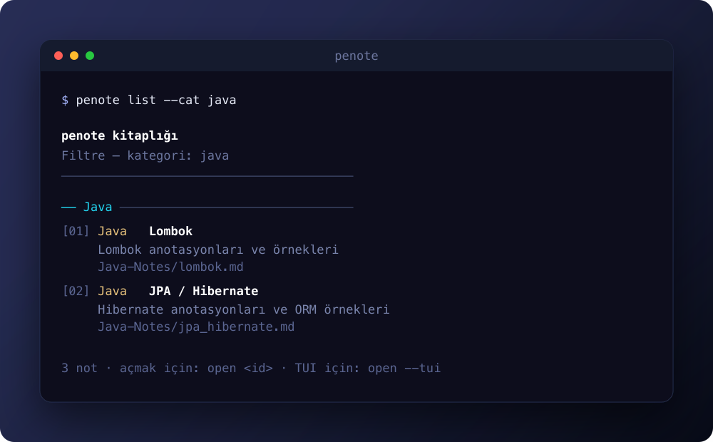

<div align="center">


# penote

**Agentic learning docs — programming notes agents and humans can both read, search, and open.**

[**Install from npm →**](#install)

[](https://github.com/burakboduroglu/penote/actions/workflows/ci.yml)
[](https://www.npmjs.com/package/@burakboduroglu/penote)
[](https://github.com/burakboduroglu/penote/releases)
[](LICENSE)
[](https://github.com/burakboduroglu/penote/commits)


</div>

---

Learning material that sits in plain Markdown, organised by topic, and stays usable from a terminal, a TUI, or a browser. The same files are what AI agents read through `AGENTS.md` and what you open when you need a concept again — no CMS, no build step, no dependency tree for the notes themselves.

> The npm package is **`@burakboduroglu/penote`**. The CLI binary is **`penote`**.  
> Previously published as `devnotetr` / `devnote` — that name is retired.

## What it is

A small library of programming notes (Java, JavaScript, Python, SQL, MongoDB) plus a zero-dependency Node.js CLI that lists, searches, and opens them. Content lives in category folders; the tooling only discovers and presents it.

Notes are written in Turkish with technical terms left in English where that is clearer. The repository surface — README, contributing docs, issue forms — is English so the project sits alongside the rest of the open-source set.

## Highlights

|     | Feature | How it works |
| --- | ------- | ------------ |
| 📚 | **Topic folders** | One category per language/domain; CLI derives names from the path. |
| 🔍 | **Search** | Filter by category and keyword from the terminal. |
| 🖥️ | **Three surfaces** | Editor, interactive TUI, or local Web UI — same Markdown source. |
| 🤖 | **Agent-ready** | `AGENTS.md` tells coding agents how to add notes and leave the CLI intact. |
| 🪶 | **Zero runtime deps** | Node.js 18+ built-ins only for the CLI and a single-file Web UI. |
| 📦 | **npm package** | `penote` on your PATH after installing `@burakboduroglu/penote`. |

## Topics

| Category | Covers |
| -------- | ------ |
| Java | Lombok, JPA / Hibernate, Spring Boot |
| JavaScript | Array methods, closures, currying, async, regex |
| Python | Basics, advanced topics, database operations |
| SQL | Basic queries, advanced SQL, `psql` on the terminal |
| MongoDB | Basic CRUD and querying |

## Install

**npm** — [@burakboduroglu/penote](https://www.npmjs.com/package/@burakboduroglu/penote)

```bash
bun add -g @burakboduroglu/penote
penote help
```

**From source** — no install step required beyond [bun](https://bun.sh):

```bash
git clone https://github.com/burakboduroglu/penote.git
cd penote
bun library/cli.js help
```

## Quick start



```bash
penote list
penote list --cat java
penote search hibernate
penote open --tui
penote open --editor
```

## CLI reference

| Command | What it does |
| ------- | ------------ |
| `penote help` | Show commands |
| `penote list` | List every note |
| `penote list --cat java` | List notes in a category |
| `penote list --cat py --search temel` | Category + keyword filter |
| `penote search hibernate` | Search all notes |
| `penote open 3` | Open note `#3` in the editor |
| `penote open --tui` | Interactive TUI |
| `penote open --editor` | Open the Web UI in a browser |
| `penote open --browser 6` | Open note `#6` in the browser |

### TUI keys

`penote open --tui` is three steps: pick a category, pick a note, pick how to open it.

| Key | Action |
| --- | ------ |
| ↑ / ↓ | Move |
| Enter | Confirm the current step |
| `p` | Markdown preview |
| `e` | Open in editor |
| `b` | Open in browser |
| Backspace | Go back |
| `q` | Quit |

## Web UI

`library/index.html` is a single-file vanilla UI: category filters, instant search, and a detail view for each note. Start it with:

```bash
penote open --editor
# or from a clone
bun library/cli.js open --editor
```

## Requirements

- [Node.js](https://nodejs.org) 18 or newer to run the published CLI
- [bun](https://bun.sh) for local development
- No runtime dependencies for the CLI or Web UI

## Project layout

```text
penote/                     # GitHub repo name (local folder)
├── Java-Notes/             # Topic notes (Turkish Markdown)
├── Javascript-Notes/
├── Python-Notes/
├── SQL-Notes/
├── MongoDB-Notes/
├── library/
│   ├── cli.js              # CLI / TUI entry (`penote`)
│   └── index.html          # Web UI
├── assets/
│   └── penote-logo.svg
├── AGENTS.md
├── CHANGELOG.md
├── CODE_OF_CONDUCT.md
├── CONTRIBUTING.md
├── LICENSE
├── README.md
└── SECURITY.md
```

## Development

```bash
git clone https://github.com/burakboduroglu/penote.git
cd penote
bun library/cli.js list
bun library/cli.js search hibernate
```

| Command | What it does |
| ------- | ------------ |
| `bun library/cli.js list` | Smoke-test note discovery |
| `bun library/cli.js search <kw>` | Smoke-test search |
| `bun library/cli.js open --editor` | Local Web UI |
| `bun run start` | Same as `bun library/cli.js` |
| `bun run dev` | Open the Web UI |

CI runs the list/search smoke checks on Node 18, 20, and 22.

## Contributing

Bugs, note fixes, and small CLI/Web improvements are welcome. Read [CONTRIBUTING.md](CONTRIBUTING.md) and the [Code of Conduct](CODE_OF_CONDUCT.md) first. Security reports go through [SECURITY.md](SECURITY.md), not the public tracker.

## License

[MIT](LICENSE) © Burak Boduroğlu
